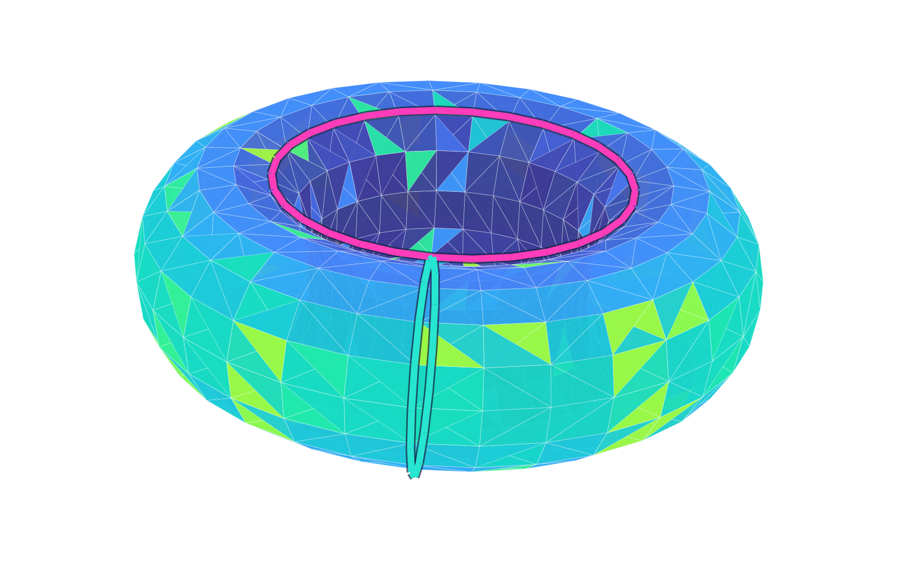
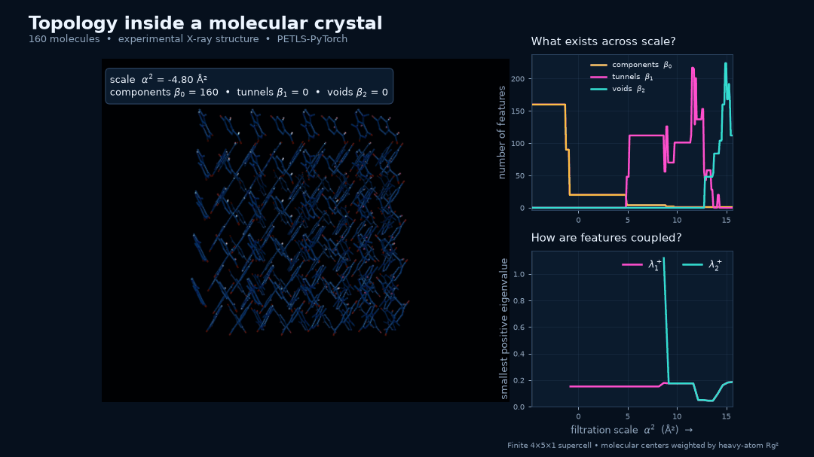

# petls-pytorch

[](https://pypi.org/project/petls-pytorch/)
[](https://github.com/Sylverity/petls-pytorch/actions/workflows/ci.yml)
[](https://github.com/Sylverity/petls-pytorch/actions/workflows/security.yml)
[](https://pypi.org/project/petls-pytorch/)
[](LICENSE)

<p align="center">
  
</p>

<p align="center"><em>One component, two independent tunnels, one enclosed surface: β = (1, 2, 1).</em></p>

**PETLS-PyTorch turns point clouds, graphs, and molecular trajectories into
multiscale topological signatures, with PyTorch-native CPU and CUDA
eigensolvers.** It answers three complementary questions:

- **What persists?** Betti numbers and persistence intervals track components,
  tunnels, and voids across scale.
- **How is it organized?** Persistent-Laplacian spectra distinguish structures
  that have the same hole counts but different geometry or connectivity.
- **Where is it?** Harmonic representatives map a feature back to the points,
  simplices, or molecules that support it.

The hero is an actual Alpha complex at `α² = 0.30`; the magenta and cyan paths
represent its two independent one-dimensional classes. The
[figure source](examples/torus_hero/render_hero.py) is fully reproducible.

## Performance

The included benchmark harness measures complex construction, Laplacian
construction, and eigensolving on identical inputs. On one representative
78-trial workload (RTX 4070 Ti, PyTorch 2.10.0+cu130):

| Backend | Device | Total trial time | Mean trial | Mean eigensolve |
|---|---|---:|---:|---:|
| `petls-pytorch` | CPU | 2.20 s | 28.2 ms | 24.2 ms |
| `petls-pytorch` | CUDA | 1.05 s | 13.4 ms | 9.7 ms |

CUDA reduced total time by about **52%** and mean eigensolve time by about
**60%** for this workload. Performance depends on matrix size, GPU, dtype, and
the requested spectrum; use the benchmark suite to measure your own case.

```bash
uv run --extra benchmark python -m benchmark --preset standard \
  --package petls-pytorch --algorithm eigvalsh --device cuda --dtype float32
```

Results include device and dtype metadata plus skipped and failed requests under
`benchmark-results/`. See [technical notes](docs/technical-notes.md#benchmarks)
for CPU, stress-test, reference-PETLS, and custom-workload commands.

## Install

```bash
pip install petls-pytorch
```

CPython 3.10–3.14 is supported. For GPU execution, install the CUDA-enabled
PyTorch build appropriate for your system using the
[official PyTorch installer](https://pytorch.org/get-started/locally/).

Optional extras add benchmark datasets (`petls-pytorch[benchmark]`) or the CIF
and plotting dependencies used by the crystal demo
(`petls-pytorch[analysis]`).

## Quick start

```python
import torch
import petls_pytorch

alpha = petls_pytorch.Alpha(
    points=[[0, 0], [1, 0], [1, 1], [0, 1]],
    weights=[0.20, 0.18, 0.20, 0.18],
    max_dim=2,
    max_alpha_square=1.0,
    device="cuda" if torch.cuda.is_available() else "cpu",
    dtype=torch.float64,
)

summary = alpha.topology_summary(dimensions=(0, 1), a=0.0, b=0.0)
spectrum = alpha.spectra(dim=1, a=0.0, b=0.0)
intervals = alpha.persistence_intervals(dim=1)
features = alpha.harmonic_features(dim=1, a=0.0, b=0.0)
```

The same analysis interface works across the supported constructions:

| Construction | Class | Typical input |
|---|---|---|
| Weighted or ordinary Alpha | `Alpha` | Point coordinates and optional power weights |
| Vietoris–Rips | `Rips` | Point coordinates or a distance matrix |
| Directed flag | `dFlag` | Weighted directed graphs in `.flag` format |
| Cellular sheaf | `PersistentSheafLaplacian` | Filtered complexes with restriction maps |

Core methods include `get_L()`, `spectra()`, `eigenpairs()`,
`persistence_intervals()`, `topology_summary()`, `harmonic_features()`, and
`estimate_laplacian()`.

## From a crystal to an interpretable signature



This example reduces a public experimental **160-molecule,
1,920-heavy-atom crystal** to a scale-dependent signature:

- **Left:** the violet Alpha scaffold grows through the crystal; the magenta
  cage localizes one selected harmonic 2-cycle to the molecules supporting it.
- **Top right:** `β₀`, `β₁`, and `β₂` count connected regions, tunnels, and
  enclosed voids. The white cursor marks the scale rendered on the left.
- **Bottom right:** the smallest positive 1- and 2-Laplacian eigenvalues reveal
  organization that Betti numbers alone cannot distinguish.

Applied frame-by-frame, the same workflow creates interpretable time series for
assembly transitions, packing changes, persistent scale ranges, and the
molecules driving each change.

The [complete demo](examples/theobromine_crystal/render_demo.py),
[reproduction guide](examples/theobromine_crystal/README.md), and
[public experimental CIF](examples/theobromine_crystal/7235246.cif) are included.
This is a finite-supercell demonstration, not periodic homology or a binding
energetics calculation.

## Numerical behavior

- CPU is the default; select `"cuda"` explicitly or use `"auto"`.
- `float32` and `float64` are supported; weighted Alpha defaults to `float64`.
- Gudhi persistence is the authoritative homology source for Gudhi-backed
  complexes, while numerical nullity and spectral diagnostics are reported
  separately.
- Dense-allocation guards estimate matrix size before construction. Oversized
  persistent requests can raise or return homology-only results.
- Sparse solvers are available for partial ordinary spectra; persistent
  Schur-complement calculations may still become dense.

See [technical notes](docs/technical-notes.md) for filtration semantics, solver
selection, localization behavior, allocation controls, the `.flag` format, and
the full benchmark command set.

## Project

PETLS-PyTorch is a clean-room, PyTorch-native implementation built on the
foundational persistent-Laplacian work of Ben Jones, Guo-Wei Wei, and the
[PETLS project](https://github.com/bdjones13/PETLS). The reference
[documentation](https://www.benjones-math.com/software/PETLS/) and
[paper](https://arxiv.org/abs/2508.11560) define the shared mathematical context;
parity tests cover common workflows without incorporating original source code.

Issues and pull requests are welcome. See [CONTRIBUTING.md](CONTRIBUTING.md) for
development setup and checks. Licensed under [Apache-2.0](LICENSE).

## Citation

If you use `petls-pytorch` in research, cite this software and the original
PETLS paper.

```bibtex
@software{marston2026petlspytorch,
  title     = {petls-pytorch: A PyTorch-native implementation of persistent topological Laplacians},
  author    = {Marston, Sumner K.},
  year      = {2026},
  publisher = {Sylverity Research},
  url       = {https://github.com/Sylverity/petls-pytorch}
}

@misc{jones2025petlspersistenttopologicallaplacian,
  title         = {PETLS: PErsistent Topological Laplacian Software},
  author        = {Benjamin Jones and Guo-Wei Wei},
  year          = {2025},
  eprint        = {2508.11560},
  archivePrefix = {arXiv},
  primaryClass  = {math.AT},
  url           = {https://arxiv.org/abs/2508.11560}
}
```
